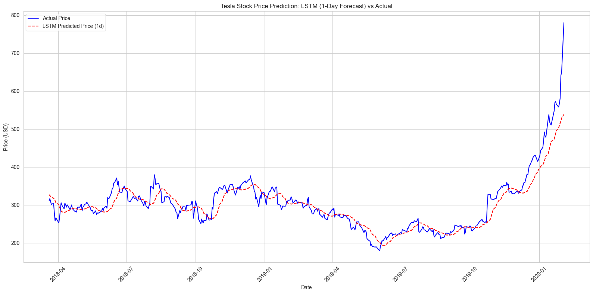

# 🚀 Tesla Stock Price Prediction using RNN & LSTM

A deep learning project to predict Tesla (TSLA) stock prices using historical data with SimpleRNN and LSTM models. This project compares model performance across different forecast horizons (1-day, 5-day, 10-day) and provides actionable insights for algorithmic trading and investment strategies.

[](https://www.python.org/)
[](https://www.tensorflow.org/)
[](https://jupyter.org/)

## 📌 Project Overview

The goal of this project is to build and evaluate Recurrent Neural Network (RNN) models to forecast the future price of Tesla stock. By analyzing historical closing prices from 2010 to 2020, we develop predictive models that can assist in algorithmic trading and risk assessment.

This project was completed as part of a Data Science & Machine Learning program, focusing on time-series forecasting, deep learning, and financial analysis.

## 🔧 Technical Stack

- **Language:** Python
- **Libraries:**
  - `pandas`, `numpy`: Data manipulation and numerical computation.
  - `matplotlib`, `seaborn`: Data visualization.
  - `tensorflow.keras`: Building and training SimpleRNN and LSTM models.
  - `sklearn.preprocessing`: Scaling the data with MinMaxScaler.
- **Environment:** Jupyter Notebook (Visual Studio Code)
- **Data Format:** CSV (Yahoo Finance historical data)

## 🏗️ Project Architecture

## 📈 Key Findings & Model Performance

After training and evaluating both SimpleRNN and LSTM models for 1-day, 5-day, and 10-day predictions, the results were as follows:

| Model                 | RMSE (USD) | MAE (USD) |
| :-------------------- | :--------- | :-------- |
| **SimpleRNN (1-day)** | **14.25**  | **9.14**  |
| SimpleRNN (5-day)     | 20.09      | 14.79     |
| LSTM (10-day)         | 23.55      | 18.27     |
| LSTM (5-day)          | 24.32      | 17.83     |
| SimpleRNN (10-day)    | 25.09      | 17.98     |
| LSTM (1-day)          | 28.29      | 19.09     |

> ✅ **Conclusion:** The **SimpleRNN model excelled at short-term (1-day) prediction**, outperforming the more complex LSTM. This suggests that for immediate trend-following, a simpler architecture can be more effective. However, the **LSTM showed better performance for longer horizons (10-day)**, demonstrating its strength in capturing long-term dependencies.

## 📊 Visualization



_(Replace `path/to/your/graph.png` with the actual path to the graph image you saved, e.g., `images/prediction_plot.png`. If you haven't saved it as an image yet, use [File > Save As] in VS Code's plot viewer.)_

> The plot shows the model's ability to capture the general trend of Tesla's stock price but highlights its difficulty in predicting sudden, sharp movements.

## 💼 Business Use Cases & Implications

- **Algorithmic Trading Signal Generator:** The high-performing 1-day SimpleRNN model can be used as a signal to buy/sell, especially when combined with volume filters and stop-loss rules.
- **Risk Management:** Understanding the average prediction error (~$14 USD) helps investors quantify potential risks and adjust their portfolio exposure.
- **Long-Term Investment Planning:** While not perfect, the model's trend analysis can support long-term holding decisions by confirming bullish or bearish market phases.

## ⚠️ Limitations

- **Market Volatility:** Stock prices are inherently volatile and influenced by unpredictable external factors (news, earnings reports, global events).
- **Single-Feature Model:** This model uses only historical `Adj Close` prices. Real-world accuracy would improve significantly with additional features like trading volume, news sentiment, or macroeconomic indicators.
- **Past Performance ≠ Future Results:** The model is trained on data up to 2020 and may not generalize perfectly to current market conditions.

## 🔮 Future Improvements

- **Feature Engineering:** Incorporate technical indicators (RSI, MACD), social media sentiment scores, or economic data.
- **Model Architecture:** Experiment with GRU units, Transformer models, or ensemble methods (e.g., averaging SimpleRNN and LSTM predictions).
- **Hyperparameter Tuning:** Use `KerasTuner` or `Optuna` to automate the search for optimal window size, number of layers, and dropout rates.

## 📂 How to Run

1.  Clone the repository:
    ```bash
    git clone https://github.com/B4Mprofessor/tesla-stock-price-prediction-rnn-lstm
    cd tesla-stock-price-prediction-rnn-lstm
    ```
2.  Open `notebooks/tesla_stock_eda_and_modeling.ipynb` in Jupyter Notebook (via VS Code, JupyterLab, or Google Colab).
3.  Install the required dependencies:
    ```bash
    pip install tensorflow pandas numpy matplotlib seaborn scikit-learn
    ```
4.  Run all cells in the notebook to reproduce the entire pipeline.

## 🎯 Final Report

For a detailed explanation of the methodology, data preprocessing steps, model development, and evaluation metrics, please refer to the final markdown section within the Jupyter Notebook.

---

> Built with ❤️ for data science enthusiasts and aspiring quant traders.
